## 👋 Hola, soy Kevo Rojas

Ingeniero **DevOps / Cloud**. Trabajo con infraestructura en producción: **Kubernetes, GitOps y automatización**. En [YouTube](https://www.youtube.com/channel/UCh90SEOKMI2Q2ThXjvFrJag) y en [kevorojas.com](https://kevorojas.com) muestro cómo lo hago, paso a paso.

- 🌐 Blog bilingüe (ES / EN) de tutoriales: **Kubernetes, GitOps, CI/CD, Azure y Terraform**
- 🎥 Videos donde construyo y explico infraestructura real
- 📫 Escríbeme desde [kevorojas.com](https://kevorojas.com)

## 🧰 Stack

**☁️ Cloud**

**📦 Contenedores & Orquestación**

**🧱 Infraestructura como código**

**🔁 GitOps & CI/CD**

**🐧 OS & Scripting**

## 🖥️ whoami

## 🎥 Últimos videos de YouTube

<!-- YT:START -->
- [Me compré unas Quest 3 y terminé construyendo un Iron Man HUD con IA local](https://www.youtube.com/watch?v=YFvQTetQkGg)
- [GitOps en acción: de cluster vacío a configuración base](https://www.youtube.com/watch?v=qc5j60a92uo)
- [Cómo funciona GitOps con ArgoCD en 2025 &lpar;explicación simple y clara&rpar;](https://www.youtube.com/watch?v=-lLhQIChNhg)
- [Secrets en git? Parte 1 | GitOps &amp; kube sealed secrets](https://www.youtube.com/watch?v=fcaAaaIQozM)
- [GitOps con ArgoCD y Gitlab-CI](https://www.youtube.com/watch?v=tFxJ4sLFKio)
<!-- YT:END -->

➡️ [Ver más videos](https://www.youtube.com/channel/UCh90SEOKMI2Q2ThXjvFrJag)

---

**¿Construyendo algo con Kubernetes o GitOps?** Pásate por [kevorojas.com](https://kevorojas.com) 👋

